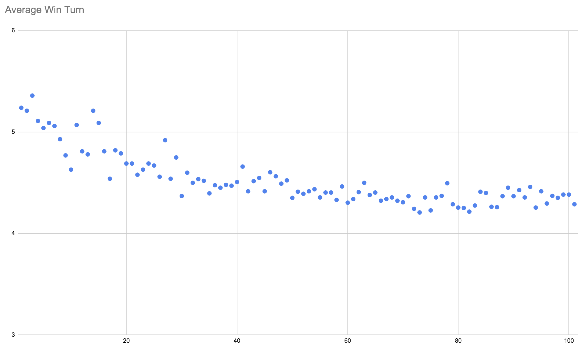
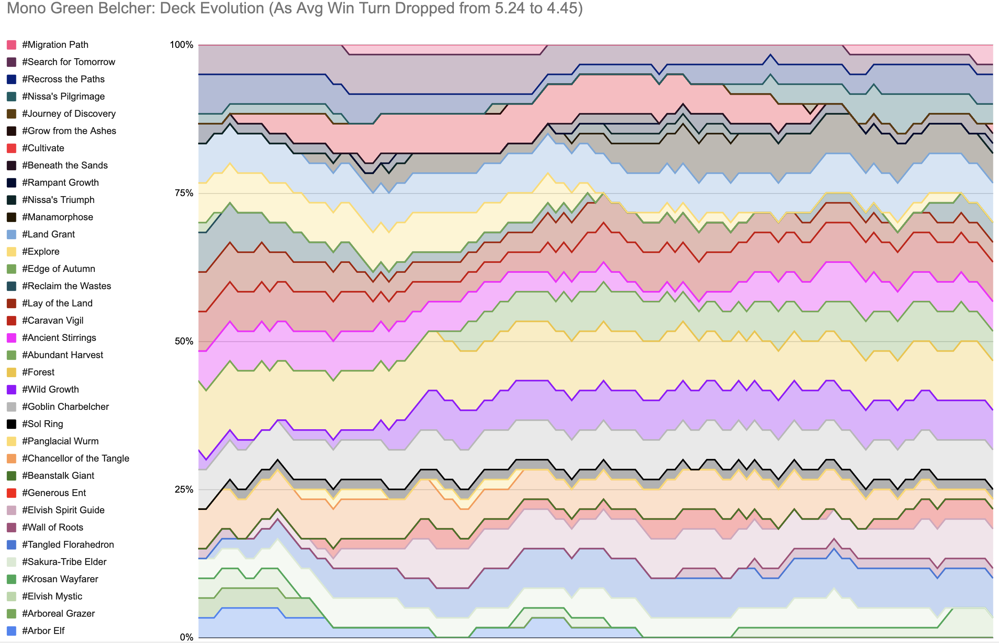
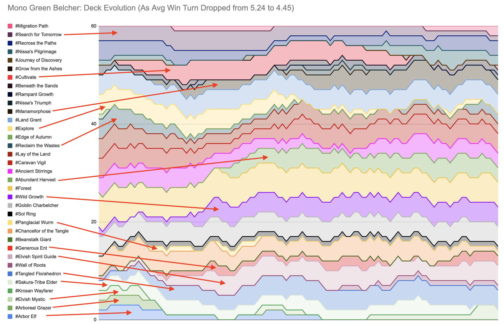

"Why gold fish for a few hours and take notes when I can spend a month writing code to do it for me" - @riley

# 7-Land Mono-Green Belcher
So in Magic: The Gatheirng, one of my favorite ways to play is a format called "Budget Vintage", which is a 60-card constructed format, vintage ban/restricted list, with a price limit (usually in the neighborhood of $30) applied to the entire decklist (as measured by TCGmid or TCGlow or whatever we agree upon). It's been one of my [favorite formats](https://www.reddit.com/r/budgetdecks/comments/95dbl4/25_cheapo_supremo_mazes_end/) for [years](https://www.reddit.com/r/budgetdecks/comments/95mzac/25_cheapo_supremo_monou_faeries/), and one of [my favorite pet decks](https://www.reddit.com/r/budgetdecks/comments/954kli/budget_vintage_25_7land_monogreen_belcher/) is Mono-Green Belcher. It's adapted from a fringe C-tier Modern list that I first saw played by [Jeff Hoogland](https://www.youtube.com/watch?v=HjZSmpNdEjY&list=PLMgaV3fg_ghCClIKaBQGPtkkqdbHtR3O4&index=1) and [Corbin Hosler](https://www.youtube.com/watch?v=mbRZLTt2lEI). It (traditionally) plays 7 Forests in the deck and it never ceases to be hilarious to me when it can pull all the lands out so reliably and belch the opponent for the win.

But over the years since I first started playing the deck, Wizards has printed a [number](https://scryfall.com/card/znr/211/tangled-florahedron-tangled-vale) of [new](https://scryfall.com/card/eld/149/beanstalk-giant-fertile-footsteps) [cards](https://scryfall.com/card/ltr/169/generous-ent) that I've thought would make good additions -- but what do I cut?  For instance, I know that [Abundant Harvest](https://scryfall.com/card/mh2/147/abundant-harvest) is a strict upgrade over [Lay of the Land](https://scryfall.com/card/cn2/185/lay-of-the-land), but what about other changes that aren't so obvious? I've been afraid of making too many changes lest I throw off the balance of the deck.

# Laziness as a Virtue

So I obviously needed to play a bunch of games in order to test it out... but then I thought -- why should I goldfish my deck for dozens of games when I can enslave a computer to goldfish my deck thousands of times for me?

Enter: The Auto-Belcher 9000 (tm) -- (Patent Pending)

Thus I wrote a (relatively straightforward) program in Python to iterate through thousands and thousands of games of Magic, testing out different card combinations, and reporting the results.

# How It Works

This program was inspired by the great Dr. Ruckus whose [awesome video](https://www.youtube.com/watch?v=Xq4T44EvPvo) introduced me to the concept of using monte-carlo experimentation to tune goldfished Magic: The Gathering decks.

# Results (preliminary: 101 epochs)

For those interested in the raw data output, there are some [preliminary results available](https://docs.google.com/spreadsheets/d/162uHpexmKK21qb5sc4liTHA1qK_MYm1jFjKZzFHk6gU/edit?usp=sharing) for the first 101 epochs of training (roughly 10 hours).

For starters, here's a graph showing how our average win turn declines over time.

Nice! In 10 hours of learning, we speed up our average win by nearly a full turn!

Note: I'm still experimenting to find the best way to present the rest of the data so that it's understandable. Feedback is appreciated!

Here's a [Flourish animation](https://public.flourish.studio/visualisation/18088180/) of the first 128 epochs:

https://github.com/HanClinto/mtg_belcher_montecarlo/assets/796749/e45c2db3-63fd-4616-8a3c-88fc83a0fe92

Let's break it down and see what changes were made at each step in order to do that. 

This is a graph of the entire 60-card deck and how the cards change in it over time.

Let's add some arrows so you can more easily understand what each of the blobs correspond to. The taller the blob, the more of that card are in the decklist. Most cards are limited to 4, but some are limited to 1 (Sol Ring), and some are unlimited (Forest).

## What We Learn about What It Learns (initial results)

Some cool things are visible from this data -- let's go through them from top to bottom.

### Search for Tomorrow

Search is a good card (it's notable in that it's one of the ramp cards whose lands come into play untapped), and its dual casting cost gives it flexibility which is always valued. Even though it's slowly getting squeezed out over time, I wouldn't be surprised to see the algorithm bring it back later in a moderate capacity.

### Cultivate

Commander players know the power of Cultivate and I was expecting it to perform well here. Unsurprisingly the algorithm wasted little time in adding 4 copies by Epoch 22... and then it seemed to get bored with it and it phased it out almost as quickly in favor of other options. This was a funny blip to see, and like Search, I wouldn't be surprised if it came back in the future.

### Manamorphose

This one surprises me a bit, but also doesn't. Manamorphose is classic in Storm decks for effectively reducing the size of your deck by 1... but the trouble with it is that you never know what card you're going to draw, and so adds a bit of uncertainty in exchange.

This is where we get into a downside of the Monte Carlo method of simulation -- the simulator is able to abuse the random shuffler to its advantage. 

The simulator effectively never misses for random effects like Ancient Stirrings, because any branch where it missed is not evaluated. If the simulator has two cards in hand -- a Land Grant and a Manamorphose, which should it cast first? Well, because the simulator uses branching trees, it's able to evaluate both options and "cheat" by taking the better of the two options. While I've done a bit of what I can to mitigate this foresight, I haven't eliminated it entirely. Perhaps changing the way the shuffler works (maybe just not shuffling at all?) would be the best way to resolve this.

### Explore

Interesting to see this one go -- I always thought the extra land drop was really powerful, but maybe there are better things for it to do. 

A lot of fast wins come about because the simulator will play belcher in one turn, and then activate it the next. This leaves the belcher open to artifact removal, so I may want to change the rules to force it to be able to play + activate on the same turn. This might help the model prioritize getting to 7 mana (rather than just 4), and effects like Explore might increase in value in such a case.

### Reclaim the Wastes

This one doesn't make sense to me -- Reclaim the Wastes is a strict upgrade over Lay of the Land, but yet it phased out Reclaim and kept Lay. Why?

One guess is that the extra possibilities available in Reclaim the Wastes were overloading the branching tree -- the branching tree algorithm limits the number of branches to a certain number (currently set to 1000 in this experiment), and randomly prunes branches that are above this limit. It's possible that the extra branches from Reclaim the Wastes was triggering this pruning effect, and the extra benefit gained from the second mode on Reclaim the Wastes wasn't outweighing the cost of the random pruning.

Also, I might just have a bug in my implementation of this one, and that might be the other reason. Or it could just be random noise. No idea.

### Abundant Harvest

But in contrast to the above decision not making sense, this one makes perfect sense, and is extremely satisfying to see.

When I first saw Abundant Harvest be printed, I recognized it as a strict upgrade over Lay of the Land. It's essentially Lay of the Land, but with Cycling(1). 

I was tempted to add 4 copies to my deck instantly, but I resisted the urge. Instead, I decided to run a little experiment with it, and see if the algorithm could recognize it as a good card and make the substitution on its own.

So I implemented the card's functionality, set its intial decklist quantity to 0, and waited. Lo' and behold, it found it, and added it to the deck! It wasn't the highest priority change that it made (not adding its first copy until Epoch 32), but after that it wasted very little time -- bumping up to 3 copies by Epoch 35, and topping it off with a fourth in Epoch 47.

Seeing the algorithm discover and add this card in so decisively was very much a "proud dad" moment for me. 🙂

### Wild Growth (and Arbor Elf)

Wild Growth is a card that's highly dependent on forests being on the battlefield, and with too many non-land mana sources (Elvish Mystic, Sol Ring, Chancellor, Elvish Spirit Guide), I wasn't sure if it was a keeper or not.

Also, there are some logical shenigans that I have to play in order to determine whether or not I get to use the mana from the Wild Growth the turn that I play it, but I don't think they're too unreasonable:

This is only ~90 epochs worth of training (each epoch runs roughly 5000 games -- it runs 250 games for each variation of the deck). After each training cycle (epoch) it looks at the average win rate of each 61 card deck and each 59 card deck and picks the pair of best-performing changes to make as substitutes for the next epoch. It then uses that modified deck as the new 60-card baseline for the next epoch and repeats the process again.

It keeps track of the average turn that the deck wins on, and uses that to measure its performance.

The deck I was testing with started with averaged a win on turn 5.24, and after last night's training run it's hovering winning on an average of turn 4.4 or so.

This is still less than a hundred epochs so far (about 10 hours of training), but I want to train it for several hundred (maybe over a thousand?) if I can.
